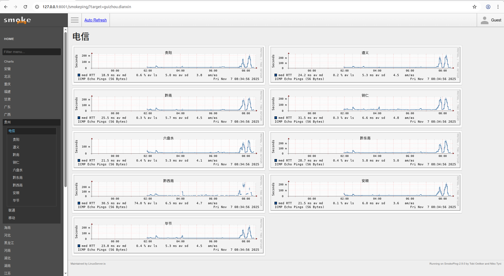
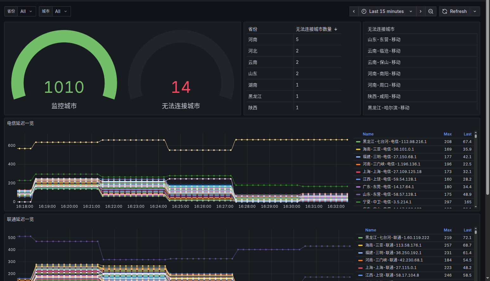

## 概述

- 更换ip库：放弃了之前的网站，重新找了一份ip地址库，并且会定期更新
- 部署方式变更：使用docker容器部署，方便部署，
- 加入更多城市：不但跟踪省会以及重要城市，还有地级市也一并跟踪了
- 自动更新ip：每3个小时处理不能ping通的ip，并且从ip库找一个可用的ip地址更新
- 更换最新页面：可以选择使用原生的页面，也可以prometheus+pushgateway+grafana查看更细致的页面

## 安装

```
docker volume create idc_ping_monitor_V
docker run -d --name idc_smokeping -p 8001:80 -v idc_ping_monitor_V:/opt -v ./data:/data registry.cn-beijing.aliyuncs.com/wilsonchai/idc_smokeping:v1
docker run -d --name idc_sidecar -v idc_ping_monitor_V:/opt -v ./data/:/data registry.cn-beijing.aliyuncs.com/wilsonchai/idc_sidecar:v1
```

这里需要注意的是，./data文件存放了所有城市的ping数据，idc_smokeping与idc_sidecar需要共享该目录。如果之前的数据不想要，可直接删除即可

如果有需要推送到pushgateway，那就需要重新配置`idc_sidecar`

注：prometheus需要`idc_ping_monitor`启动6分钟之后才会有数据

```
docker rm -f idc_sidecar
docker run -d --name idc_sidecar -e PUSHGATEWAY_URL=10.22.12.178:9091 -v idc_ping_monitor_V:/opt -v ./data/:/data registry.cn-beijing.aliyuncs.com/wilsonchai/idc_sidecar:v1
```

## 详解

- `idc_smokeping`：使用smokeping作为数据采集端，负责采集到各城市ip的ping数据，存为rrd格式的数据文件，每3分钟采集一次，并且每3小时会应用一次新的城市ip（如果有更新）
- `idc_sidecar`：
  - 使用cron+python脚本，每小时检查城市ip是否能够ping通，如果不能ping通，就立刻在ip库中更换一个
  - 如果配置了环境变量：`PUSHGATEWAY_URL`，那每3分钟将各个城市的数据采集到pushgateway，从而进入prometheus，方便后续分析
- `./data`：各城市的ping数据存放在宿主机当前目录的`./data`下面，便于保存、备份或者删除
- `idc_ping_monitor_V`：docker volume，用来存放各城市的ip地址以及ip库

## 效果

1）原生的效果图



2）grafana



这里需要注意的是：该panel有2个参数：省份和城市。省份可以选择，由于城市过多（1010个），选择城市的时候需要自行输入

## 代码仓库

[`idc_ping_monitor`](https://github.com/wilsonchai8/idc_ping_monitor)

最后再来分析一下仓库目录下的代码组成，方便大家使用

```
▶ tree -L 1
.
├── grafana
├── sidecar
└── smokeping

```

- `grafana`目录主要存放了grafana的模版文件，需要的时候直接导入进grafana即可
  ```
  ▶ ls -l grafana
  total 20
  -rw-rw-r-- 1 wilson wilson 18946 11月  5 18:43 全国速率监测（地级市版）.json

  ```

- `sidecar`目录主要存放了各种操作城市数据相关的脚本

- `smokeping`目录主要存放了smokeping相关的配置文件

