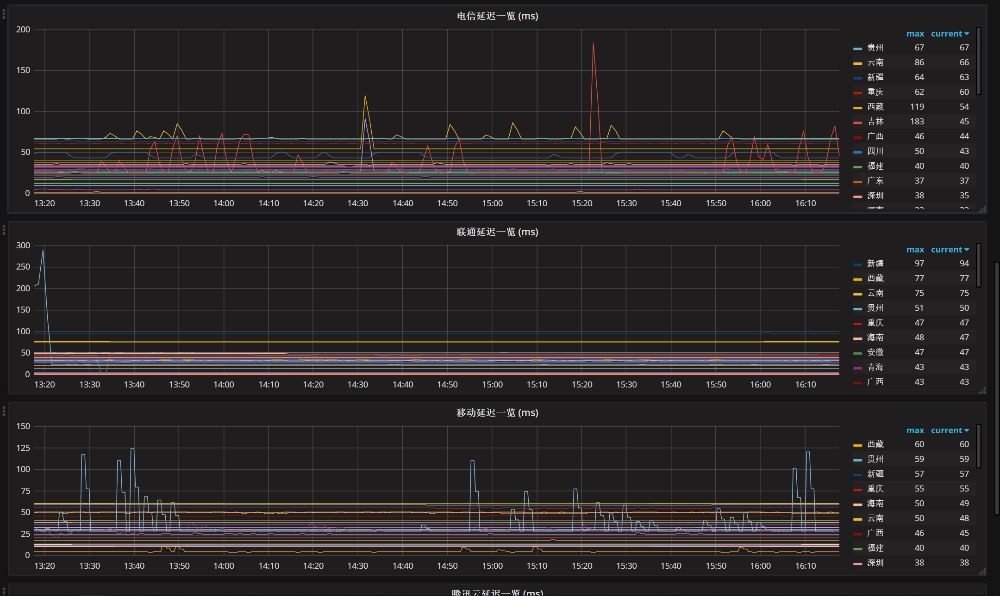

> 一、概述

IDC机房测速工具，由3个组件组成：  
smokeping：主要负责采集数据  
prometheus：主要负责存储数据  
grafana：主要负责采集数据  

> 二、使用

```
cd /tmp
git clone https://github.com/wilsonchai8/idc_ping_monitor.git
```

>> （1）smokeping

smokeping的家目录：

```
smokeping_home_dir=/usr/local/smokeping
```

创建config文件，并且配置全国各区域ip监测点

```
cd $smokeping_home_dir/etc
cp -rf /tmp/idc_ping_monitor/smokeping/location/* ./
```
监测点主要由国内的三大运营商的IP站点组成，也可以自定义需要检测的站点，更多的ip地址，可以参考 <http://ip.yqie.com/china.aspx> 

启动：

```
mkdir -p $smokeping_home_dir/cache
mkdir -p $smokeping_home_dir/data
mkdir -p $smokeping_home_dir/var
chmod -R 0755 $smokeping_home_dir
chmod 600 $smokeping_home_dir/etc/smokeping_secrets.dist
$smokeping_home_dir/bin/smokeping
```

错误：

```
Resetting LC_NUMERIC failed probably because your international setup of the LC_ALL to "en_US.UTF-8" is overridding LC_NUMERIC.  Setting LC_ALL is not compatible with smokeping... at /usr/local/smokeping/bin/../lib/Smokeping.pm line 47.
Compilation failed in require at /usr/local/smokeping/bin/smokeping line 12.
BEGIN failed--compilation aborted at /usr/local/smokeping/bin/smokeping line 12.
```
处理方式：
```
unset LC_ALL
```

>> （2）prometheus

把smokeping采集的数据通过rrdtool读取之后，按照一定的格式推送到prometheus的gateway，时间间隔是1分钟

```
cp /tmp/idc_ping_monitor/prometheus/collection_to_prometheus.py $smokeping_home_dir
```

配置crontab

```
crontab -e 

* * * * * python /usr/local/smokeping/collection_to_prometheus.py
```

>> （3）grafana

将模板导入grafana即可，效果大概是这样


